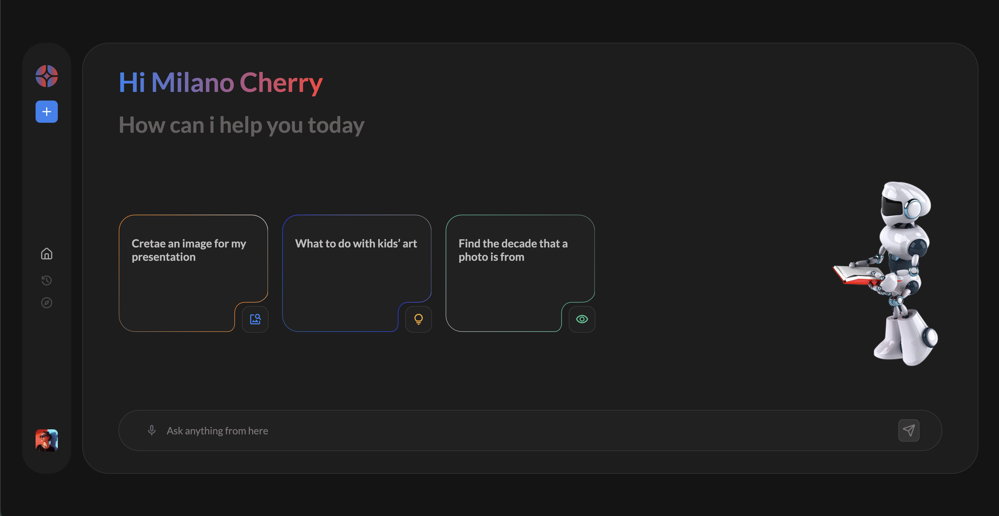

# Chatbot UI (React + TypeScript)

## Overview

This project is a chatbot interface built with React and TypeScript based on a provided Figma design.
The main goal was to recreate the UI as accurately as possible while implementing a clean component structure, proper state management, and smooth user interactions.

The chatbot uses the GPT API (model 4o-mini) to generate responses.

**Note:**
This project uses a test API key with limited credits ($2).
I am aware that the key is exposed on the frontend. In a production environment, the API key should be handled on the backend to ensure security.

---

## Screen shot



---

## Live Demo

👉 https://chat-bot-project-nine.vercel.app/

---

## Tech Stack

* React
* TypeScript
* Vite
* SCSS

---

## Getting Started

1. Clone the repository:

```bash
git clone https://github.com/KasperZaw/chat-bot.git
```

2. Navigate to the project folder:

```bash
cd chat-bot
```

3. Install dependencies:

```bash
npm install
```

4. Run the development server:

```bash
npm run dev
```

### Available Scripts

* `npm run dev` – runs the app in development mode
* `npm run build` – builds the production version
* `npx prettier --write .` – formats the code

---

## Environment Variables

To run this project locally, you need to provide your own API key.

Create a `.env` file in the root of the project and add:

```bash
VITE_OPENAI_API_KEY=your_api_key_here
```

The application uses this key to communicate with the GPT API (4o-mini model).

**Note:**
Make sure your `.env` file is not committed to version control (it should be included in `.gitignore`).

---

## Project Structure

* `/src/components` – reusable UI components
* `/src/assets` – icons, images, and static assets
* `/src/styles` – global styles and variables
* `/src/containers` – components that combine multiple UI elements
* `/src/layouts` – main layout structures

---

## Approach

The implementation focused on:

* recreating the Figma design with high visual accuracy
* keeping components small, reusable, and readable
* handling user interactions in a predictable way
* avoiding overengineering (no backend)

---

## What Could Be Improved

If this project were extended further:

* message persistence (localStorage or backend)
* authentication so each user has their own chats
* more advanced animations and transitions
* making all UI elements fully interactive

---

## Author

Kacper Zawadzki
